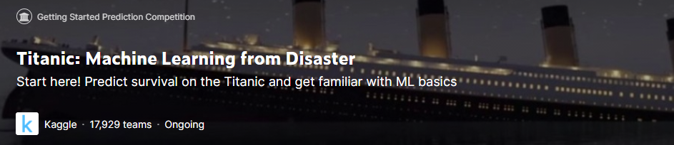

  
# The Titanic Challenge

My Solution to the Titanic Kaggle Challenge will be presented as a Tutorial. Care will be taken to provide extensive explaination and guidance using both markdown and commenting. Several approaches to the problem will be presented in addition to pros and cons of each, in addition to discussions on subjectivity and bias when dealing with incomplete data.

* <b><ins>This solution is still in progress</ins></b>
    * Preprocessing, EDA, and Visualization are complete
    * Modeling is in progress
  

## Overview

I will be breaking this challenge up between two different notebooks:
* This first notebook will focus on exploration and visualization of the data, including preprocessing the data to remove missing values, and feature engineer
* The second notebook will focus on the modeling required to predict survival

### Focus of Preprocessing
>* Exploration of Missing Values (NaN Observations)
>* Consider Either Removal or Imputation 
>   * Column or Row Deletion
>   * Linear/Mean Imputation

### Focus of EDA
>* Data Import
>* Exploration of the Variables 
>   * Datatype
>   * Range
>   * Min/Max/Mean
>   * Unique Values
>   * Visualization of Data Distributions
    
--------------
Following both the **EDA** and **Preprocessing** steps, visuals and preprocessed dataframes (.csv) will be exported to their respective folders within the working directory.

### <u>Requirements</u>
* Data can be obtained from Kaggle (data is also included in this repository)
* Python Libraries: 
    * numpy
    * pandas
    * matplotlib
    * scikit-learn 

